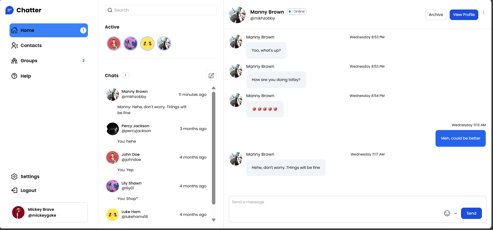
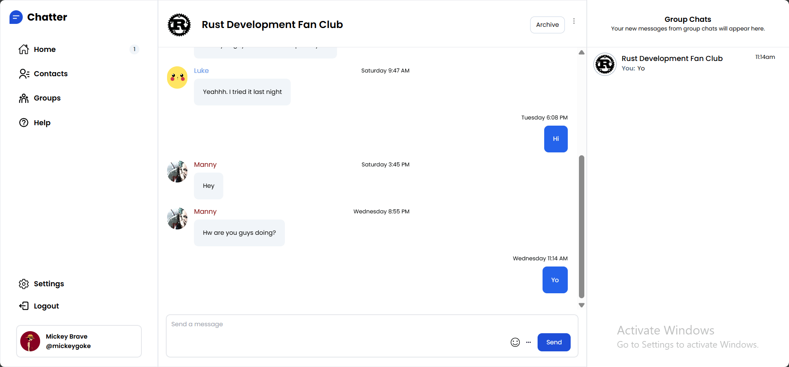
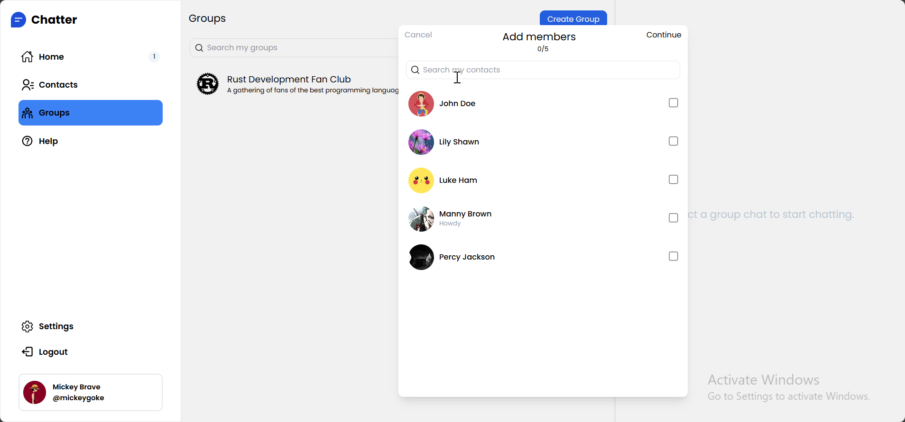
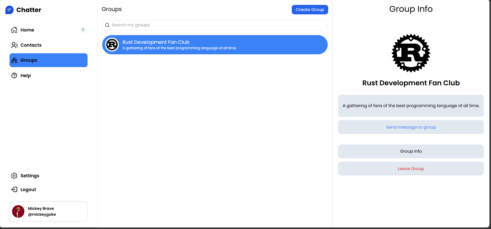

# Chatter

## Project Overview
A real-time messaging platform built using React on the front-end and Django with DRF on the back-end.

## Features Demo

    
    

    
    

## Technologies Used
### Frontend
- React w/ Typescript
- React Router
- Vanilla + Tailwind CSS
- Fetch API
- React (Typescript)
- TailwindCSS
- Vite
### Backend
- Django
- Django Rest Framework
- Django Channels
- Redis
- PostgreSQL
- JWT Authentication